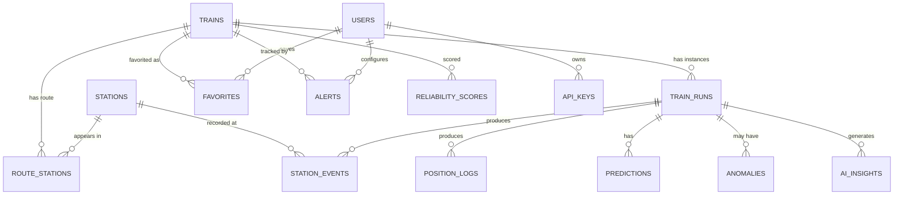

# 5. Database Schema

Full SQL DDL: [`/database/schema.sql`](../../database/schema.sql)

## 5.1 Technology Choices

- **PostgreSQL 16** as primary store (relational integrity for reference data).
- **PostGIS extension** for geospatial types (station points, route linestrings, GPS pings) and spatial queries (map-matching via `ST_LineLocatePoint`, `ST_ClosestPoint`).
- **TimescaleDB extension** for `position_logs` (high-volume GPS time series) — enables hypertable partitioning, continuous aggregates, and efficient retention policies.
- **Redis** (separate, see [§7](07-system-architecture.md)) for live-state cache (current position per active run, leaderboard of active trains) — not part of the relational schema but referenced.

## 5.2 Entity-Relationship Overview

## 5.3 Table Notes

| Table | Purpose | Key design decisions |
|---|---|---|
| `stations` | Master list of ~7,300 stations | `geom GEOGRAPHY(POINT)`; bilingual names; sourced from data.gov.in |
| `trains` | Master list of trains | `runs_on_days` as `BIT(7)` for Mon–Sun; `train_type` enum (Rajdhani, Shatabdi, Vande Bharat, Mail/Express, Passenger, Suburban, Freight*) |
| `route_stations` | Static schedule (the "timetable") per train, ordered by sequence | `scheduled_arrival_offset`/`departure_offset` stored as `INTERVAL` from journey start (handles multi-day journeys cleanly) |
| `train_runs` | One row per (train, calendar date) — an actual journey instance | `status` enum tracks lifecycle; `data_quality` flags source reliability |
| `position_logs` | Raw GPS pings (TimescaleDB hypertable, partitioned by `recorded_at`) | `source` enum: `crowd_gps`, `ntes_scrape`, `interpolated`; `geom GEOGRAPHY(POINT)` |
| `station_events` | Actual arrival/departure per station per run | Delay columns are **generated columns** (computed from actual − scheduled) |
| `reliability_scores` | Pre-computed daily reliability score per train | `components JSONB` stores the formula breakdown for explainability |
| `predictions` | ML-generated ETA predictions, versioned | `model_version` allows A/B testing and rollback |
| `anomalies` | Detected operational anomalies (unscheduled long halts, route deviations) | Feeds AI insights & ops dashboard |
| `ai_insights` | Generated natural-language insight text per run | Cached so UI doesn't regenerate on every request |
| `users`, `favorites`, `alerts`, `notifications_log` | Standard app/account tables | Phone-first auth (OTP) common in India |
| `api_keys` | B2B API access | `tier` drives rate limits via Redis |

## 5.4 Retention & Partitioning

- `position_logs`: TimescaleDB hypertable, **1-day chunks**, retention policy compresses chunks >30 days old and drops raw pings >2 years (aggregated `train_runs`/`station_events` retained indefinitely for the Time Machine + analytics, since they are far smaller).
- `train_runs` / `station_events`: standard tables, indexed on `(train_number, run_date)` — partitioning by year if volume requires (13,000 trains × 365 days × ~25 stations ≈ **120M rows/year** for `station_events`; manageable with good indexing, partition by year if needed at scale).

## 5.5 Indexing Strategy (highlights)

- `route_stations(train_number, sequence_number)` — fast schedule lookup.
- `train_runs(train_number, run_date)` UNIQUE — one run per train per day.
- `station_events(run_id, sequence_number)` — ordered station table per run.
- `position_logs` — TimescaleDB time index on `recorded_at` + `(run_id, recorded_at)` composite.
- GiST indexes on all `geom` columns for spatial queries.
- `reliability_scores(train_number, computed_at DESC)` — latest score lookup.
