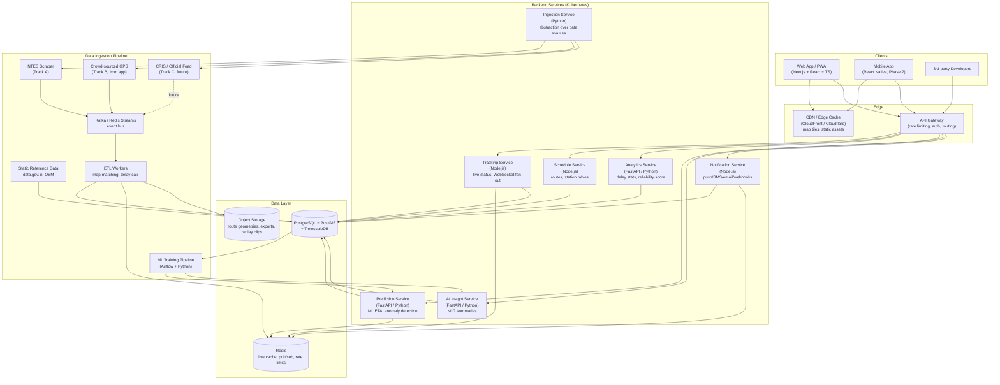
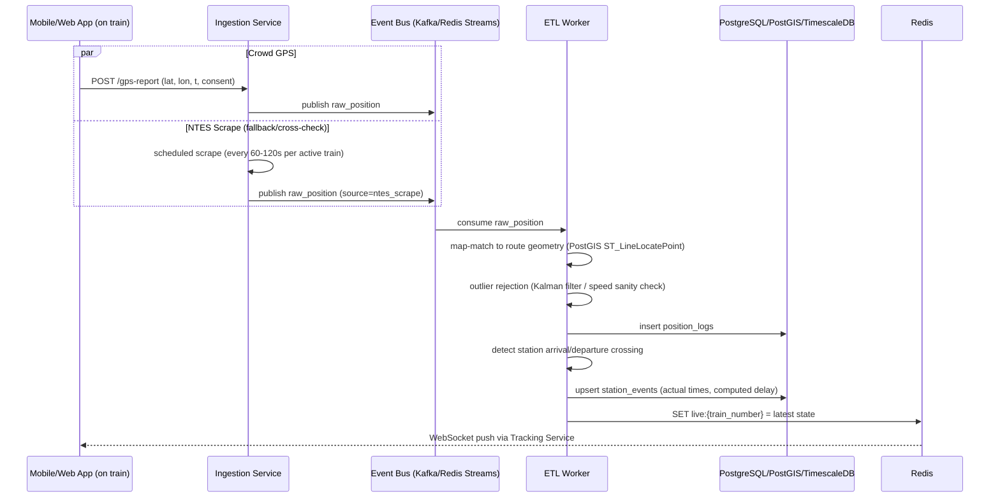
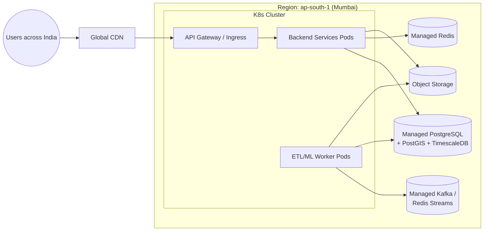

# 7. System Architecture

## 7.1 High-Level Architecture

## 7.2 Service Responsibilities

| Service | Language/Framework | Responsibilities | Scaling notes |
|---|---|---|---|
| **Tracking Service** | Node.js (NestJS) | `/live`, WebSocket fan-out of position updates, reads hot state from Redis | Horizontally scaled; WebSocket connections sharded via Redis pub/sub |
| **Schedule Service** | Node.js (NestJS) | Static route/timetable data, station search | Heavily cached (CDN + Redis), low write volume |
| **Analytics Service** | Python (FastAPI) | Delay stats, reliability score, comparisons, exports | Reads materialized views; CPU-bound aggregations run as scheduled jobs, served pre-computed |
| **Prediction Service** | Python (FastAPI) | Serves ML model inference for ETA/delay-probability | Model artifacts loaded from S3; horizontal pods behind GW; consider GPU only if deep models needed (likely not — gradient boosting is CPU-fine) |
| **AI Insight Service** | Python (FastAPI) | Generates NLG insight text (template-based + LLM-assisted), caches per run | Rate-limited LLM calls; cache aggressively (insights regenerate only on material state change) |
| **Notification Service** | Node.js | Alert evaluation, push (FCM/APNs), SMS (MSG91/Twilio), email, webhooks | Queue-driven (Bull/Redis) |
| **Ingestion Service** | Python | **The critical abstraction layer** — normalizes NTES scrape, crowd GPS, and (future) official feeds into a common `position_logs`/`station_events` schema | Designed so Track A can be disabled/replaced without downstream changes |

## 7.3 Data Ingestion Pipeline (Detail)

**Key design point:** multiple sources write to the same normalized `position_logs` table with a `source` tag and `accuracy_m`. The ETL layer reconciles conflicting sources (e.g., prefer high-accuracy crowd GPS over NTES's coarse "last station" updates) — this reconciliation logic is isolated so that adding an "official_feed" source (Track C) is additive, not a rewrite.

## 7.4 Deployment Topology

- Single region (Mumbai, `ap-south-1`) for V1 — lowest latency to Indian users and to Indian data sources; multi-AZ for HA.
- Read replicas of PostgreSQL for analytics-heavy queries, separate from the live-write path.
- TimescaleDB hypertable on a dedicated instance/tablespace if `position_logs` volume grows large.

## 7.5 Why Microservices (and Why Not More)

- Split by **read/write pattern and language fit**: Node.js for I/O-bound real-time (WebSockets), Python/FastAPI for compute-heavy analytics/ML — this is the primary justification, not "microservices for its own sake".
- **Not** splitting further (e.g., separate "favorites service") — at MVP scale, a monolith-per-domain (4-5 services) is the right granularity. Over-fragmentation adds operational cost without benefit at this stage.
- All services share the same PostgreSQL instance initially (separate schemas); split databases only if a specific service becomes a scaling bottleneck.
