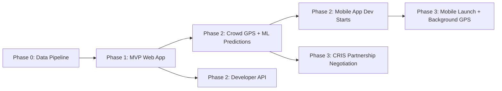

# 10. Development Roadmap

## Phase 0 — Data Foundation (Weeks 1-6)

> **Nothing else matters until this works.** Goal: prove we can reliably produce `position_logs` and `station_events` for at least 50 trains.

- Stand up PostgreSQL+PostGIS+TimescaleDB, Redis, base K8s cluster.
- Ingest static reference data: stations (data.gov.in), train master list, route/timetable data (data.gov.in "Train Schedule" dataset + manual curation for top trains).
- Build OSM-derived `route_geometries` for top 50 routes.
- Build the **Ingestion Service** abstraction with one working source: NTES scrape adapter (Track A) for ~50 high-traffic trains, with rate limiting, caching, and graceful-degradation design from day one.
- Build ETL: map-matching, station-crossing detection, delay computation.
- **Exit criteria:** for 50 trains, `train_runs`/`station_events`/`position_logs` populate correctly for at least 7 consecutive days with >90% data completeness.

## Phase 1 — MVP (Weeks 7-16, ~2.5 months)

- **Web app (Next.js PWA):** search, live tracking dashboard (map + status + schedule table), basic share links.
- **API:** `/trains/search`, `/trains/{n}`, `/trains/{n}/route`, `/trains/{n}/live`, `/trains/{n}/live/schedule`.
- **Time Machine v1:** date picker + replay for trains/dates with available data (rule-based interpolation between station events if GPS density low).
- **Reliability score v1** (formula-based, [§4.4.1](04-feature-breakdown.md#441-reliability-score-formula-v1)).
- Basic delay analytics (7/30-day avg, most-delayed stations).
- Disclaimers, data-freshness UI, EN+HI localization.
- Expand coverage to **top 500 trains**.
- **Launch:** public beta, freemium model live.

## Phase 2 — V1 (Months 4-9)

- **Crowd-sourced GPS (Track B):** opt-in location sharing in PWA (foreground) + begin React Native app development for background tracking.
- **ML-based predictions:** ETA for next station/destination, confidence scores, further-delay probability (XGBoost models trained on Phase 0/1 historical data).
- **AI insight generation** (template + LLM hybrid).
- **Anomaly detection** (unscheduled halts, route deviations) feeding an internal ops dashboard.
- User accounts, favorites, alerts (push/SMS), shareable replay clips/GIFs.
- Developer API self-serve + docs site, free tier launch.
- Expand coverage toward **top 2,000 trains**.

## Phase 3 — V2 / Advanced (Months 10-18)

- React Native mobile apps (iOS/Android) launch — background GPS crowd-sourcing at scale.
- Delay heatmaps, seasonal trend analysis, day-of-week deep dives, train/route comparison tool.
- Congestion forecasting, zone/division aggregated dashboards for B2B/ops users.
- Pursue **Track C (CRIS/official data partnership)** — by this point we have traction data and a working product to negotiate with.
- Multi-language expansion (regional languages: Bengali, Tamil, Telugu, Marathi, Gujarati).
- Full national coverage (all ~13,000 trains), freight tracking exploration.
- Enterprise/B2B tier: zone benchmarking, white-label dashboards for travel partners.

## 10.1 Milestone Summary Table

| Phase | Duration | Key Deliverable | Trains Covered |
|---|---|---|---|
| 0 — Foundation | 6 weeks | Working data pipeline | 50 |
| 1 — MVP | 10 weeks | Public beta web app | 500 |
| 2 — V1 | 6 months | ML predictions, accounts, API | 2,000 |
| 3 — V2 | 8-9 months | Mobile apps, full coverage, B2B | 13,000 |

## 10.2 Critical Path Dependencies

