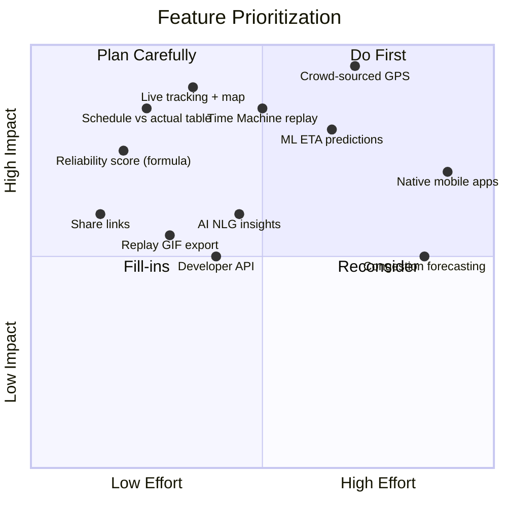

# 11. MVP vs Advanced Features

## 11.1 MVP (Phase 1, ships first)

| Feature | Detail |
|---|---|
| Train search | Number/name autocomplete, EN+HI |
| Live status | Position, current/next station, distances, status badge |
| Live map | Marker + route polyline, OSM/Leaflet |
| Schedule vs actual table | All stations, color-coded delay |
| Current/max/avg delay (today) | Computed live |
| Time Machine v1 | Date picker + replay (interpolated if needed) |
| Reliability score (formula-based) | 0-100 with breakdown |
| Basic delay analytics | 7d/30d avg, most-delayed stations |
| Share links | Public read-only URL |
| Data freshness indicators | "Updated Xs ago", source tag |
| EN/HI localization | Core UI strings |
| PWA | Installable, basic offline cache |

## 11.2 V1 — Advanced (Phase 2)

| Feature | Detail |
|---|---|
| Crowd-sourced GPS | Opt-in, foreground (web) then background (mobile) |
| ML-based ETA predictions | Next station + destination, confidence score |
| AI-generated insights (NLG) | Per-run narrative summaries |
| Anomaly detection | Unscheduled halts, route deviation flags |
| User accounts | Favorites, saved trains |
| Alerts | Push/SMS delay notifications |
| Replay export (GIF/clip) | Shareable Time Machine clips |
| Developer API (self-serve) | API keys, OpenAPI docs, free tier |
| Day-of-week performance | Charted breakdown |
| Recovery stations | Where train makes up time |

## 11.3 V2 — Advanced / Future

| Feature | Detail |
|---|---|
| Native mobile apps (iOS/Android) | React Native, background location |
| Delay heatmaps (seasonal) | Station × month/season grid |
| Route/train comparison tool | Multi-train side-by-side |
| Congestion forecasting | Predictive network-level load |
| Zone/division ops dashboards | B2B/internal IR use |
| Regional language support | Bengali, Tamil, Telugu, Marathi, Gujarati |
| Full national coverage (13K trains) | Including freight (separate model) |
| Webhook subscriptions | For B2B partners |
| Official data partnership (CRIS) | Strategic, ongoing from Phase 2 |

## 11.4 Feature Prioritization Matrix (Impact vs Effort)

